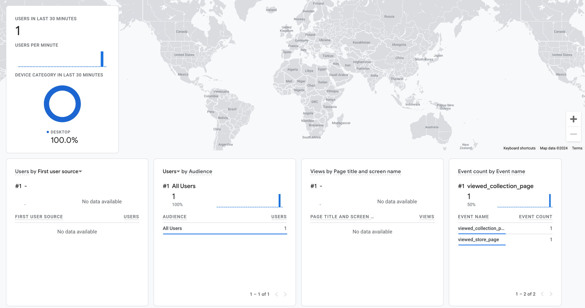

In today's fast-paced digital analytics landscape, the key to staying ahead lies in leveraging versatile tools that enable both comprehensive data collection and its subsequent enhancement. Google Analytics 4 (GA4) Measurement Protocol stands out as a pivotal resource for marketers aiming to elevate their data-driven strategies. This tool excels in tracking crucial events server-side, including offline conversions, and enriching data collection with detailed insights. This guide delves into the nuances of GA4 Measurement Protocol, exploring its core, implementation techniques, and varied applications.

## Understanding GA4 Measurement Protocol

Google Analytic 4 Measurement Protocol is a data collection method offering a flexible and scalable solution to track user interactions across digital assets such websites. This data collection method, unlike the traditional JavaScript-based tracking, allows for the collection of data through server-to-server communication. This not only provides enhanced accuracy but also facilitates data collection where traditional JavaScript tracking may be challenging. An example of this would be backend environments such as python, Ruby or PHP.

It's essential to understand that this protocol is designed to augment measurements from gtag.js or Google Tag Manager, not to replace them. Clarifying this distinction is crucial, as it is often misconceived as a substitute for these tools.

## Setting Up: Measurement ID and API Secret

### Getting the Measurement ID and API Secret

The first things we need to use the Measurement Protocol are the Google Analytics Measurement ID and the API Secret Key. The Measurement ID is rather easy to get. This a unique identifier for your GA4 property that gets generated with the creation of the property. To find this ID, you need to go to the admin section. Here are the steps to follow to get your Measurement ID:

1. Go to the Admin section
2. Under the **Data collection and modification**, click on Data streams
3. Click on the data stream of your choice
4. In the steam details section, you will find the Measurement ID
5. Copy this value

As for the API secret key, it can be found within the same space as the Measurement ID. Once you have open the details of the data stream of your choice, under the Events section, click on **Measurement Protocol API secrets**. Next, click on create, give your key a nickname and click on save.

### Constructing the Payload

Since we have the Measurement ID and the API secret, it is time to construct the payload we are going to send to Google Analytics 4. For this tutorial, we are going to use, gtag.js and not Firebase. Before we get into the weeds of this, please make sure to familiarize yourself with the following:

- [How sessions are counted in Google Analytics 4](https://support.google.com/analytics/answer/9191807)
- [Google Analytics 4 reserverd names](https://developers.google.com/analytics/devguides/collection/protocol/ga4/reference?client_type=gtag#reserved_names)
- [Google Tag API gtag function](https://developers.google.com/tag-platform/gtagjs/reference#get_mp_example)

These concepts cover key components that you need to understand in order to use the Measurement Protocol. The rest of this tutorial can be read without reading the resources, but it is highly recommended that they are consulted and properly understood.

Let's have a look at the payload of an event to be sent through the Measurement Protocol:

```js
const measurement_id = `G-XXXXXXXXXX`;
const api_secret = `<secret_value>`;

fetch(
  `https://www.google-analytics.com/mp/collect?measurement_id=${measurement_id}&api_secret=${api_secret}`,
  {
    method: "POST",
    body: JSON.stringify({
      client_id: "XXXXXXXXXX.YYYYYYYYYY",
      events: [
        {
          name: "tutorial_begin",
          params: {},
        },
      ],
    }),
  }
);
```

In order for an event to be sent through the Measurement Protocol, the following needs to be provided in the request body:

- client_id: A unique identifier for a client. This is different than a Firebase app_instance_id. To get the client_id, use [gtag.js('get')](https://developers.google.com/gtagjs/reference/api#get_mp_example).
- user_id: Optional. A unique identifier for a user. Can only contain utf-8 characters. See [User-ID for cross-platform analysis](https://support.google.com/analytics/answer/9213390) for more information about this identifier. It recommended that this parameter is sent in the request body. To get the user_id, you can use the \_ga cookie as described in [GA4 Cookie Usage](https://support.google.com/analytics/answer/11397207?hl=en).
- consent: Optional. Learn how to set [consent settings](https://developers.google.com/analytics/devguides/collection/protocol/ga4/reference#payload_consent).
- events: An array of event items. You can include multiple events in one request. In order for user activity to display in reports like [Realtime](https://developers.google.com/analytics/devguides/reporting/data/v1/realtime-basics), engagement*time_msec and session_id must be supplied as part of the params for an event. The session_id can be fetched using the \_ga *<container-id> cookie.

Let's look at a payload that provides all the parameters described above

```json
{
  "client_id": "123456.7654321",
  "events": [
    {
      "name": "campaign_details",
      "params": {
        "campaign_id": "google_1234",
        "campaign": "Summer_fun",
        "source": "google",
        "medium": "cpc",
        "term": "summer+travel",
        "content": "logolink",
        "session_id": "123",
        "engagement_time_msec": "100"
      }
    }
  ]
}
```

## Data Stitching4

As mentioned above, the Measurement Protocol is not to be used as a replacement for Google Tag Manager or gtag for data collection. It is a tool that allows to enhance tracking in order to enrich data collection. That being said, it is important to understand how data is captured, processed and stitched with the existing data. To do so, we can look at the documentation to understand how Google will process information we are sending through the Measurement Protocol.

#### Stitching data to the current session

One important distinction to make when working with the Measurement Protocol is the environment we are in when data is being sent. Usually, said environments are back-end environments where browser-level data is not accessible. Why is this important? Data stitching. Data stitching is the practice of tying data collected from different environments to give a clearer view over a specific topic. In our case, we will be tying data sent from our back-end environments to browser-level data to give a clearer picture about user behaviour.

One common case of stitching data is **offline conversions**. For instance, we can use the Measurement Protocol to track users down a funnel as they move from lead, to SQL to SAL etc. However, in order for the data to be used outside of Events reporting, we will need an indicator that allows for such a thing to happen, and that indicator is the session_id. The session_id is a key parameter in data stitching and it is highly recommended that it is send along in the event payload. Let's breakdown why such an event parameter is important.

As highlighted by Google's documentation for the Measurement Protocol, when a new session_id is sent in the payload a new session will start, hence a new session will be counted. Why does Google count a new session? It is because sessions count is an estimation of the unique collected session ids. Before working with server-side events, it is highly recommended to familiarize yourself with how [sessions are counted](https://support.google.com/analytics/answer/9191807), and how your implementation can influence this metric. Let's take a look at how the payload would look like with the session_id:

```json
{
  "client_id": "123456.7654321",
  "events": [
    {
      "name": "campaign_details",
      "params": {
        "campaign_id": "google_1234",
        "campaign": "Summer_fun",
        "source": "google",
        "medium": "cpc",
        "term": "summer+travel",
        "content": "logolink",
        "session_id": "123",
        "engagement_time_msec": "100"
      }
    }
  ]
}
```

To reiterate, if the session_id does not exist a new session will start. If the session_id does exist, that's when the magic of data stitching happens. When Google is able to identify the session, the server-side events get stitched to the session and attribution becomes possible. This is very important especially if the server-side event will be used as a conversion.

### Stitching data to the current user

While session-level attribution is important, being able to stitch data to the user is beneficial. For instance, such practice allows us to breakdown server-side events based on first touch attribution, that is the first channel of acquisition. Combining both user and session stitching gives full visibility as we can combine both browser-level data and server-side data to understand the user journey.

Stitching data to the user happens when we send the client_id \in the payload. The user_id can also be sent in the event payload if you have it enabled for your site. The most important parameter, though, is the client_id as Google uses it to identify users. If you are sending the user_id in the payload, make sure that you are sending it at the browser-level as well to avoid duplication. Google Analytics 4 will not depulicate users if the client_id or the user_id changes. If you want to use the user_id in the Measurement Protocol , it is crucial to ensure that you are identifying users prior to sending the server-side event. Here's what the payload would look like with the user_id:

```json
{
  "client_id": "123456.7654321",
  "events": [
    {
      "name": "campaign_details",
      "params": {
        "campaign_id": "google_1234",
        "campaign": "Summer_fun",
        "source": "google",
        "medium": "cpc",
        "term": "summer+travel",
        "content": "logolink",
        "session_id": "123",
        "user_id": 542197212,
        "engagement_time_msec": "100"
      }
    }
  ]
}
```

## Events Validation

Before sending data to Google Analytics 4, you can validate your events to avoid any errors. Google Analytics 4 has a validation server that you can send your events to for debugging purposes. The only difference between the Measurement Protocol and the Validation Server is the URL /debug/mp/collect. Everything else remains the same.

```js
const measurement_id = `G-XXXXXXXXXX`;
const api_secret = `<secret_value>`;

fetch(
  `https://www.google-analytics.com/debug/mp/collect?measurement_id=${measurement_id}&api_secret=${api_secret}`,
  {
    method: "POST",
    body: JSON.stringify({
      client_id: "XXXXXXXXXX.YYYYYYYYYY",
      events: [
        {
          name: "tutorial_begin",
          params: {},
        },
      ],
    }),
  }
);
```

## Response

| Key                  | Type                                                                                                                                                        | Description                      |
| -------------------- | ----------------------------------------------------------------------------------------------------------------------------------------------------------- | -------------------------------- |
| `validationMessages` | Array<[ValidationMessage](https://developers.google.com/analytics/devguides/collection/protocol/ga4/validating-events?client_type=gtag#validation_message)> | An array of validation messages. |

## ValidationMessage

| Key              | Type                                                                                                                                           | Description                                     |
| ---------------- | ---------------------------------------------------------------------------------------------------------------------------------------------- | ----------------------------------------------- |
| `fieldPath`      | string                                                                                                                                         | The path to the field that was invalid.         |
| `description`    | string                                                                                                                                         | A description of the error.                     |
| `validationCode` | [ValidationCode](https://developers.google.com/analytics/devguides/collection/protocol/ga4/validating-events?client_type=gtag#validation_code) | A ValidationCode that corresponds to the error. |

## ValidationCode

| Value                   | Description                                                                                                                                                                |
| ----------------------- | -------------------------------------------------------------------------------------------------------------------------------------------------------------------------- |
| `VALUE_INVALID`         | The value provided for a `fieldPath` was invalid. See [limitations](https://developers.google.com/analytics/devguides/collection/protocol/ga4/sending-events#limitations). |
| `VALUE_REQUIRED`        | A required value for a `fieldPath` was not provided.                                                                                                                       |
| `NAME_INVALID`          | The name provided was invalid. See [limitations](https://developers.google.com/analytics/devguides/collection/protocol/ga4/sending-events#limitations).                    |
| `NAME_RESERVED`         | The name provided was one of the reserved names. See [reserved names](https://developers.google.com/analytics/devguides/collection/protocol/ga4/reference#reserved_names). |
| `VALUE_OUT_OF_BOUNDS`   | The value provided was too large. See [limitations](https://developers.google.com/analytics/devguides/collection/protocol/ga4/sending-events#limitations).                 |
| `EXCEEDED_MAX_ENTITIES` | There were too many parameters in the request. See [limitations](https://developers.google.com/analytics/devguides/collection/protocol/ga4/sending-events#limitations).    |
| `NAME_DUPLICATED`       | The same name was provided more than once in the request.                                                                                                                  |

## Real-World Application and Testing

To test all of this, we are going to use Postman to send the Post Request to Google Analytics and see if our data is going to be captured and validate the parameters. Also, we are going to send 2 events in this payload instead of one. Here's the body of the payload:

```json
{
  "client_id": "1706397545.10.1.1706397554.51.0.0",
  "events": [
    {
      "name": "viewed_collection_page",
      "params": {
        "campaign_id": "google_1234",
        "campaign": "Summer_fun",
        "source": "google",
        "medium": "cpc",
        "term": "summer+travel",
        "content": "logolink",
        "session_id": "123",
        "user_id": "542197212",
        "engagement_time_msec": "100"
      }
    },
    {
      "name": "viewed_store_page",
      "params": {
        "campaign_id": "google_1234",
        "campaign": "Summer_fun",
        "source": "google",
        "medium": "cpc",
        "term": "summer+travel",
        "content": "logolink",
        "session_id": "123",
        "user_id": "542197212",
        "engagement_time_msec": "100"
      }
    }
  ]
}
```

And this is the response we get with this payload **Status: 204 No Content**. This status code means that the server successfully processed the request but is returning no content. And, this is what we see in Google Analytics 4's Real Time reports:


Notice that both events have been processed and only one user has been detected. This is because only one client_id has been sent. Even if we changed the user_id, Google Analytics 4 will still show one user. However, it is not recommended to change the user_ids at random.

## Conclusion

The GA4 Measurement Protocol serves as a cornerstone for marketers seeking to advance their analytics capabilities. Through server-side tracking and data augmentation, it offers unparalleled insights into user behavior, making it an indispensable tool in the marketer's arsenal. This guide aims to demystify the protocol and encourage its adoption for more sophisticated data analysis strategies.
