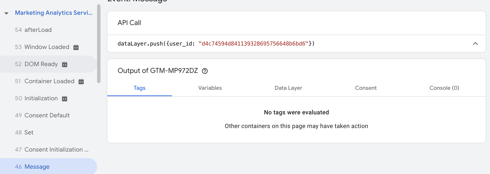
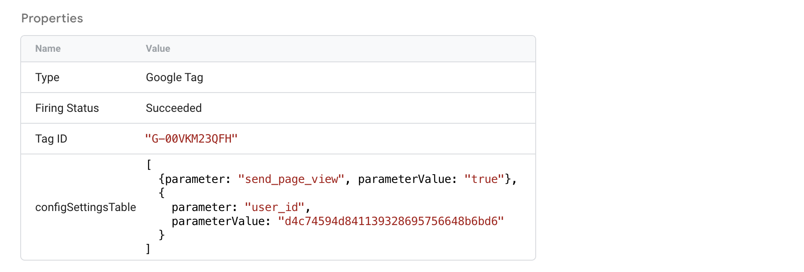
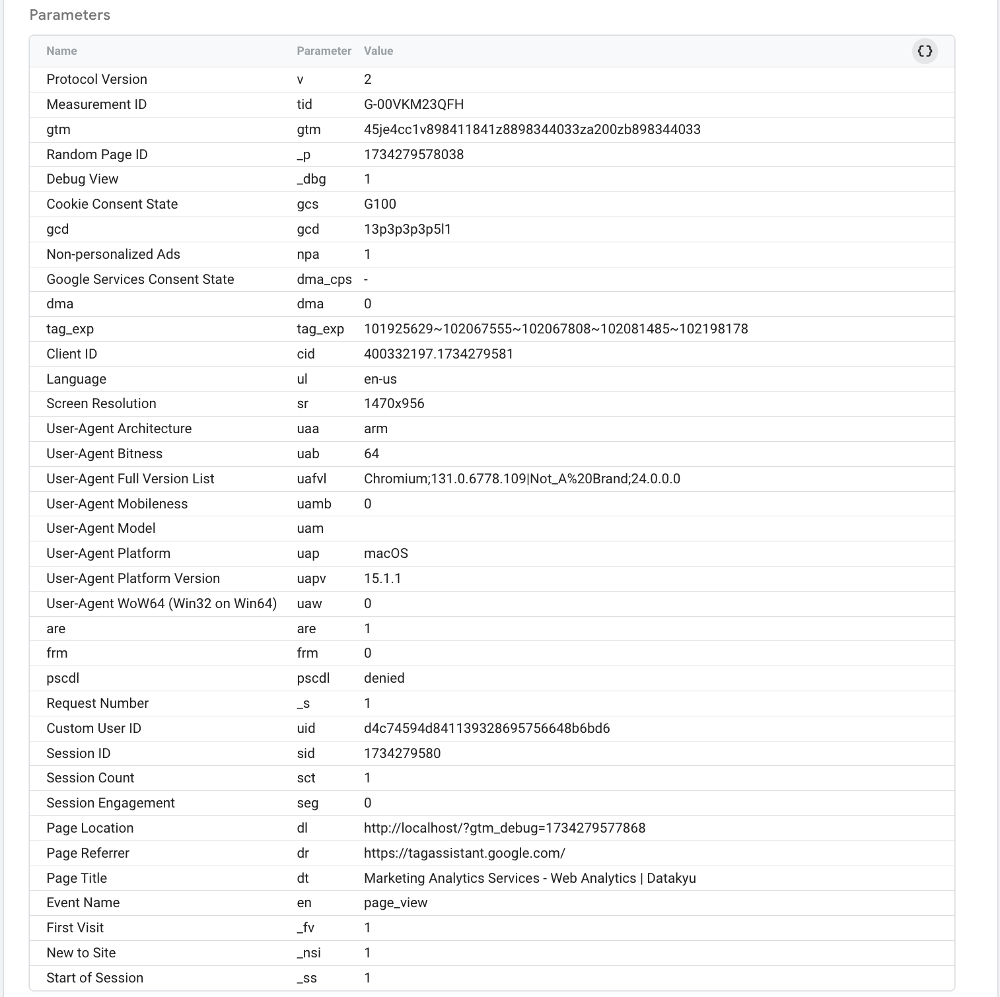

Cross-platform and cross-device tracking is one of the most crucial features you need to take advantage of if your users are accessing your website from multiple devices. If you do not have this tracking activated then you run into multiple issues including an inaccurate count of total users, non-unififed user journey, and others.

Fortunately, in Google Analytics 4, activiating cross-device and cross-platform tracking is rather easy to implement. All that is required to do is adding a user ID which will act as a persistent way to track your users across paltform and devices. Let's dive right in.

## What is a user ID in Google Analytics 4
In Google Analytics 4, a user ID acts an identifier, one that is provided by you to GA4 to identify users as 
they interact with your website or application. The most crucial feature of a user ID is that it needs to be persistent. It does not change based on the device, platform or any othe variable. It's a unique way of knowing who a user id. Mind you, a user ID cannot be a name or an email in Google Analytics 4, or at least not in the traditional sense.

In fact, no Personal Identifiable Information (PII) can be used a user ID or can be sent to Google Analytics 4. You can read more about PII in Google Analytics 4 in this [guide](https://support.google.com/analytics/answer/6366371?hl=en#zippy=%2Cin-this-article).

### What is the difference between the user ID and the client ID in Google Analytics 4
To understand the difference between the user ID and the client ID, we can take a look at the "Reporting Identity" section
under Data display in the admin section. Here are the definitions you would see:
- User ID: uses a customer-supplied ID to differentiate between users and unify events in reporting and exploration.
- Device ID: uses the client ID for websites or the app Instance ID for apps.
According to the platform-given definitions, we can see that the most clear difference between the user ID and the client ID is that the former is used unify events in reporting and explorations. The second difference is that the user ID is, as mentioned above, supplied by the user while the client ID is collected automatically by Google Analytics.

## Collecting the user ID
While implementing the user ID is highly recommended, it must be implemented correctly and only when it is needed. For instance, if your website does not support a login feature or a CRM-linked form submission, it is not recommended that you implement the user ID. The reason is mentioned in the paragraph above if you are wondering why that is. The user ID is used to unify events (and users) in reports, as such it needs to uniquely identify user otherwise it may yield similar results as tracking users withe client ID. Before implementing the user ID, ensure that you can consistently generate a unique ID for users who log in. This can be, for instance, their ID in the database. This value will never change and so it checks our requirements. If you do not have a database, you can still implement the user ID if you havce a form on your website. This is less reliable but still works. What you need is to hash the user's email upon form submission and send that as your user ID. You can use the MD5 hashing algorithm and use the output to generate a user ID. The MD5 gets the job done for deduplication and generating unique IDs.
To recap, the generate a user ID you can use either a database ID or generate one using hashing algorithms.

Now that you have a user ID, it is time to send it to Google Analytics 4. This can be done either throuhg Google Tag Manager or gtag.js. In this tutorial, we will show you both methods and you can use whatever one you prefer. We recommend using Google Tag Manager as it is more user friendly and it's easier to make modifications if needed.

## Set up user ID in GA4 using Google Tag Manager
In this step, we are going to use the collected user ID and send it to Google Analytics 4. We will admit that the user ID is already passed in the dataLayer, Google Tag Manager's window object. If you need help passing the user ID to the dataLayer, you can coordinate with your developer to do so. If you need the user to be passed before the Consent initialization, you can do so as follows:
```html
<script>
        window.dataLayer = window.dataLayer || [];
        window.dataLayer.push({
            user_id: 'd4c74594d841139328695756648b6bd6'
        });
</script>
<!-- Google Tag Manager -->
<script>
    (function (w, d, s, l, i) {
        w[l] = w[l] || [];
        w[l].push({ "gtm.start": new Date().getTime(), event: "gtm.js" });
        var f = d.getElementsByTagName(s)[0],
            j = d.createElement(s),
            dl = l != "dataLayer" ? "&l=" + l : "";
        j.async = true;
        j.src = "https://www.googletagmanager.com/gtm.js?id=" + i + dl;
        f.parentNode.insertBefore(j, f);
    })(window, document, "script", "dataLayer", "GTM-XXXXXXX");
</script>
<!-- End Google Tag Manager -->
```

The code above yields the following:


The being said, it is time to send the user ID to Google Analytics 4. Please note that you do not have to send user ID before Consent Initialization for the set up to work. You can send it on DOMContentLoaded or even on page load. You do not have to have it logged that early in the dataLayer.

### How does logging the user ID so early in the dataLayer help with tracking
Well, there are 3 mains reasons you'd want to have the user ID logged that early in the dataLayer
1. Stickiness and consistency. Having the dataLayer contain the user ID that early allows to attach it to the Google Configuration Tag ensuring all subsequent events include the user ID.
2. Debugging and deduplication. With the user ID logged that early in the dataLayer, you can use its value to depulicate events manually if you want to ensure that Google Analytics 4 is displaying the right data
3. You can use the user ID to make API calls to tools where you need a user ID to be passed in the payload. These calls can be made to other analytics tools or webhooks to external systems.

## Sending user ID to Google Analytics 4 using Google Tag Manager
Now that we have our user ID in the dataLayer, the next step is to capture said value and send it to Google Analytics 4. Before we do that though, let's talk about user ID persistence.

### What is user ID persistence?
The concept in itself is very simple, send the same identifier withe every action. That's it. In the context of Google Analytics 4, user ID persistence is about ensuring that after identification all the subsequent actions get tied to that profile. Now, according to Google Analytics 4 documentation, this is done by default which means that we would only have to set the user once (when a user logs in for example) and GA4 will take care of the rest. This being said, we can admit the user ID persists across events.
While you can rely on GA4 to handle user persistence, you can ensure it happens by sending the user ID with each event. This creates a safety net, so to speak, to ensure that all events sent to the property are carrying the user ID stamp. 

To send the user ID to Google Analytics 4, follow these steps:

- Open your Google Configuration Tag in Google Tag Manager.
- Add a new parameter called user_id in the **Configuration parameter** section.
- Set the value of this parameter to the variable you’ve created in GTM that holds the user ID (e.g., user_id).

If your data layer uses a different name for the user ID (e.g., ue instead of user_id), make sure the variable matches that name.

While this setup is sufficient, there is one thing about it that makes it very prone to errors. Can you guess what it is? It's null or undefined strings.

Null or undefined strings are a nightmare in Google Tag Manager. As far as the system is concerned, it's a valid value, and it is which is exactly why they can be the cause of big data integrity issues. Contrary to popular belief, Google Analytics 4 does not treat 'null' or 'undefined' the same way it deals with null or undefined. Let's image this scenario.

Your developer might pass 'null' or 'undefined' as the value of the user_id when the user_id cannot be fetched from your backend systems. In the setup above, a 'null' or 'undefined' string would still be sent to Google Analytics 4. As a result, all users without a user_id would be grouped together and treated as the same user. That’s one active user in your analytics, wouldn’t you say?

To avoid this issue, create a Custom JavaScript variable in Google Tag Manager and define it as follows:
```js
    function normalizeUserID(){
        if({{user_id}} === '' || {{user_id}} === null || typeof {{user_id}} === 'undefined' || {{user_id}} === 'null' || {{user_id}} === 'undefined') {
            return {{Undefined}}
        } else {
            return {{user_id}}
        }
    }
```
{{Undefined}} in this context is the Undefined variable in Google Tag Manager, and {{user_id}} is the user_id dataLayer variable. After having created the variable, make sure to use as the value for the user_id parameter in the Configuration Parameter section in the Google Configuration Tag.

If you followed the intructions up top this point then all you have to do is preview your implementation and make sure that the user_id is being sent to the Google Analytics 4 property of your choosing. You can confirm in one or two ways. The first is Google Tag Manager's preview mode and the second is Google Analytics 4 DebugView. If you will be using the preview mode, configuration tag should looks something like this:



The figure above shows that Google Tag Manager has succesfully sent the user ID to Google Analytics 4. If you want to confirm if the user ID was successfully received through Google Analytics 4. Your page_view's (or whatever event you want to use to confirm that the user ID was set) event parameters should look something like this:



You would notice, in this screenshot, the presence of both the **Client ID** and the **Custom User ID**. If things were a tad confusing, this should clear everything up. You can see that you can use both IDs at the same time, it's just the user ID your provide is "Custom" and will be used for more than user identification.

### Ensuring User ID persistence

If you want to ensure that the user ID persists that is sent as an event parameter will all the events, you can pass it either as a **Shared Event Parameter** or define as an **Event Parameter** for each event tag.

#### What is the difference between a shared event parameter and an event parameter?
The difference between shared event parameters and event parameters in Google Tag Manager is subtle. A shared event parameter is a configuration that allows you to define one or more parameters to be reused across multiple event tags, reducing redundancy. Instead of manually setting the same parameter for each tag, you can configure it once and apply it universally. In contrast, an event parameter typically refers to a parameter defined individually for a specific tag or event.

### How does Google Analytics 4 identify users with the User ID?
Users sometimes trigger events on your site or app before signing in or after signing out. In the first scenario, Google Analytics 4 associates all events from the session with the user ID once the user signs in, using the session ID as a link. In the second scenario, once a user signs out, Analytics stops associating new events with that user ID.

For instance, a user begins a session without a user ID and triggers Events 1 and 2. These events remain unassociated. When the user signs in and triggers Event 3, Events 1, 2, and 3 are all associated with the user ID. After signing out, the user triggers Event 4. This event is not associated with any user ID, but Events 1, 2, and 3 remain linked to the signed-in session.
