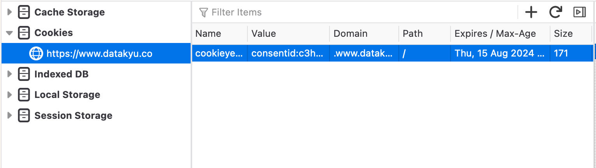
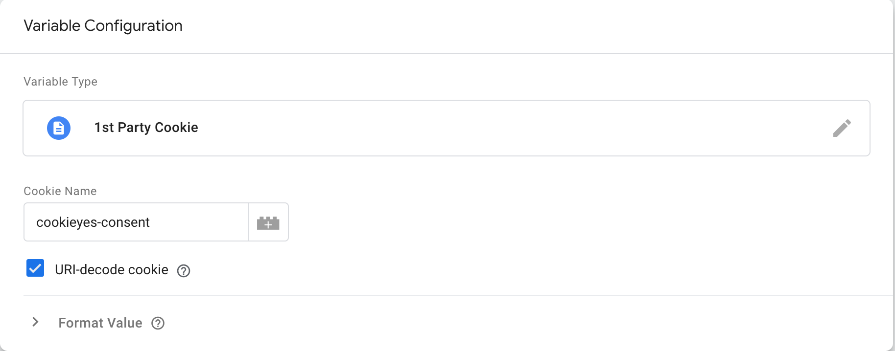
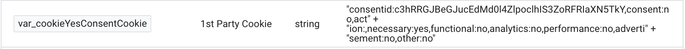
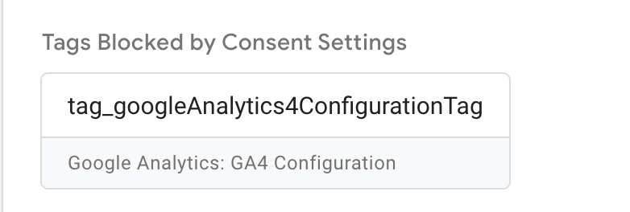

Data collection on the web has changed over the years, and while it is easier now with many tools at our disposal, it is also harder; in a sense. With data privacy laws becoming stricter and stricter, data collection and measurements have to keep up in order to stay compliant and offer the users the best experience; an honest experience that lets them know what data will be collected and what data will be tied back to them. In today's post, we will look at how you can make sure your data collection and web measurement comply with the users' consent choices. The tools we are going to be using are CookiYes as the Cookie Consent Solution, Google Consent Mode, Google Tag Manager, and Google Analytics 4. Before we begin though, let's define some terms so that everything is clear.

## Consent Mode & Cookie Consent Solution

### Cookie Consent Solution

A cookie consent solution refers to a set of tools, practices, and functionalities used by website owners and operators to obtain user consent for the use of cookies and similar tracking technologies on their websites or online platforms. Cookies are small pieces of data that are stored on a user's device (such as a computer or smartphone) when they interact with a website. These cookies serve various purposes, including analyzing user behavior, remembering login credentials, and providing personalized experiences. A cookie consent solution typically involves the following components:

1. **Consent Banner/Popup**: When a user visits a website, a banner or popup is displayed informing them about the use of cookies and similar tracking technologies. This banner typically includes information about the types of cookies used, their purposes, and a link to the website's privacy policy.
2. **Consent Management Platform (CMP)**: A consent management platform is a tool that allows website owners to create, customize, and manage their cookie consent banners and user preferences. It enables users to provide or withdraw consent for different types of cookies and allows website operators to track and document user consent.
3. **Granular Consent Options**: A good cookie consent solution provides users with granular options to choose which types of cookies they want to consent to. This could include different categories such as functional cookies, analytical cookies, advertising cookies, and more.
4. **Link to Privacy Policy**: The consent banner typically includes a link to the website's privacy policy, which provides detailed information about how the website collects, processes, and shares user data.
5. **Opt-Out Mechanism**: Users should have the ability to change their consent preferences or withdraw their consent at any time. The consent solution should provide an easy way for users to opt-out of specific cookie categories or all cookies.
6. **Documentation and Reporting**: The solution should allow website owners to keep records of user consents and provide reporting features to demonstrate compliance with relevant data protection regulations.
7. **Responsive Design**: The consent banner and user interface should be designed to work well on different devices, such as desktops, tablets, and smartphones.

Implementing a robust cookie consent solution helps website operators respect users' privacy rights, maintain legal compliance, and build trust by being transparent about their data collection and usage practices.

## Google Consent Mode

Consent Mode enables you to inform Google about your users' consent status for cookies or app identifiers. This way, tags can adjust their behavior accordingly, respecting users' choices. When you integrate Consent Mode with your Consent Management Platform (CMP) or custom setup, like a cookie consent banner, it seamlessly receives users' consent preferences. Consent Mode then dynamically adjusts the behavior of Google Analytics, Ads, and third-party tags that rely on cookies. In cases where users deny consent, instead of storing cookies, tags send signals (pings) to Google. If you are using Google Analytics 4, any gaps in data collection are supplemented by conversion modeling and behavioral modeling techniques used by Google.

## Implementing CookieYes

Now that the definitions are out of the way, we can get started with the implementation. The first step is to implement our cookie banner. As mentioned above, we are going to be using CookieYes as our CMP. Let's get into it.

The first thing to do is to head to [CookieYes's website](https://www.cookieyes.com/) and sign up for a free trial. Once your account is created, the next step is to follow up the instructions to style the cookie banner.

You can customize the cookie banner or proceed with the default template. You can always customize the banner later by heading to **Dashboard > Consent banner**. Once you are done with the set up, click next step. At this point, you should see a popup containing the installation script for your cookie banner. The only thing left is to install the script, and test it. CookieYes has a lot of integration with CMS and website builders and if you are using one, check the list because the installation may differ a bit:

### CMS & Website Builders Integrations

- Angular
- React.js
- Vue.js
- Nuxt.js
- Gatsby
- Next.js
- Kartra
- Kajabi
- MODX
- ImpressPages
- Shopify
- Weebly
- Magento
- Squarespace
- Wix
- WordPress
- Joomla
- Drupal
- Blogger

If you do not see your CMS or website builder, do not worry. Simply, copy/paste the installation script in your head element and put it as high as possible. Once you the installation is done, verify your installation. If you are having an issue, feel free to connect with support.

## Google Tag Manager & Consent Mode

Once the cookie banner has been implemented, it is time to continue the action with Google Tag Manager and the Consent Mode. Before we continue with Google Tag Manager, we need to confirm that our banner has been properly set up. To do that, head to you website and check if you are able to see the consent banner. Once you see the consent banner, confirm your choice. It does not matter what you select, so long as you make a choice. Once your choice is made, open the Web Developer Tools and find the cookies section; if you are using Firefox this should be in the Storage section. You should be seeing something as follows:



The cookie name is equal to cookieyes-consent. If you are able to see this cookie, then you are ready to continue. If you cannot see this cookie, please make sure to go over the implementation steps until you are able to see this cookie. Proceeding without this cookie will cause errors.

Time to move to Google Tag Manager (GTM). In GTM, head to the variable section, and create a new **User-Defined** variable. Select 1st Party Cookie as the type of the variable and type **cookieyes-consent** inside the Cookie Name input field. Also, make sure to check URI-decode cookie option. Your window should look something like this:



Add a name distinctive name to your variable and save it. Essentially, what we just did is create a Google Tag Manager variable that will have the same value as our cookiyes-cookie. This is going to be very useful as it will help us avoid reading the value of the cookie with JS everytime we need it. The next step is to preview the value of said varibale. To do so, we need to preview our workspace. Once your debugging window loads, select any event (window loaded for instance) and look for your variable in the variables tab. You should see something similar to this:



If you are not able to see a value attached to your cookie, try another event. If you are still seeing nothing, delete the variable and go over the creation steps one more time. Now that we have a value attached to our cookie, it is time to decode the value to understand how we can translate it into consent. Let's have a look at the value:

```
consentid:c3hRRGJBeGJucEdMd0l4ZlpoclhIS3ZoRFRIaXN5TkY,
consent:no,action:,necessary:yes,functional:no,analytics:no,performance:no,advertisement:no,other:no
```

First things first, it is important to note that this is a string. Second, this string contains the state of the consent. Third, this value will update as the use updates their consent preferences. Fourth, the part that will be using to capture the user's consent from this string is the following:

```
necessary:yes,functional:no,analytics:no,performance:no,advertisement:no,other:no
```

This substring contains the user's consent preferences regarding:

- Necessary cookies
- Functional cookies
- Analytics cookies
- Performance cookies
- Advertisement cookies
- Other cookies

The next task is to transform this substring into variables we can use to store the user's consent. Variables that we can update we every time the consent changes. To do this, we will use good old JavaScript. Here's a code snippet that allow us to create a variable that stores the user's consent regarding advertising cookies:

```js
function returnAdvertisementConsent() {
  var cookieYesConsentCookie = {{var_cookieYesConsentCookie}};
  var grantedSubstring = ',advertisement:yes,';
  if (!cookieYesConsentCookie || cookieYesConsentCookie.indexOf(grantedSubstring) === -1) {
    return 'denied';
  }
  return 'granted';
}
```

Please note that you will have to replace {{var_cookieYesConsentCookie}} with your 1st Party Cookie name created in the steps above. The code snippet checks if cookieYesConsentCookie is not falsy (this does not mean false) and if the value of cookieYesConsentCookie does not include ,advertisement:yes,. If any of these conditons are met, our variable will have the value denied. Else, the variable will have the value granded. In Google Tag Manager, create a new User-Defined variable and choose Custom JavaScript as the variable type. Paste the code snippet above, name your variable and save it. Once your variable is created, repeat the same steps for each consent type you would want to capture. Do not forget to change the value of the grantedSubstring variable to reflect the consent your need. For instance, if you are intrested in capturing Analytics consent, then the variable should be declared as follows:

```js
var grantedSubstring = ",analytics:yes,";
```

Once all of your variables have been defined, it is time to check if they have been correctly declared. For our first test, we will be accepting all cookies and check if all of our declared variables will have granted as their value. Preview the workspace where you have applied your changes, accept all cookies and take a look the variables section. Please remember to check all the variables you have created to check if you are seeing the correct values. Once you have confirmed that everything looks good, it is time for the second test. Before doing so, delete the cookieyes-consent cookie. Once that has been done, close the debugging window and preview your workspace again. You should see the consent banner showing up, and this time reject all cookies.

Please note that necessary cookies will always be accepted as they are required for the website to properly function. Once you have confirmed that the test has been successful, it is recommended to run couple of other tests where you accept some cookie categories and deny others just to ensure that everything is working as expected. Notice that we have not used the Consent Mode just yet. We will get to that part later on but fow now, we still have some configuration to do in Google Tag Manager before enabling the consent mode.

Now that we have our variables ready, we need to figure out a way to let Google Tag Manager update the variables once the user has changed their consent to make sure our events fire in respect to the user's consent. So far, if the user changes their consent, there is no way to communicate that to Google Tag Manager. This means that we are able to capture the status of the consent when the user first lands on the site, but we will not be able to adapt to their preferences if they change them. To do this, we will be using a tag that allow us to update our variables to adapt to the new consent preferences.

## Consent Mode (Google tags)

The tag we will be using to update our consent variables is Consent Mode (Google tags) made by Simo Ahava. Head to the tags section, and click on New. In the Tag Type, click on Discover more tag types in the Community Template Gallery. Use the search functionalily to find the right tag and click on Add to workspace. Once the tag has been added, it's time to configure it. The first step is to rename the tag. It's suggested that you give a distinctive name. The second step is to change the Consent Command to Update since that's the purpose of tag. The third step to map the different variables to their respective consent. Google Tag Manager has 4 consent types (read more about them in [consent types](https://support.google.com/tagmanager/answer/10718549?hl=en)):

- Advertising
- Analytics
- Personalization
- Functionality
- Security

It is important to map the right variables to the right cosent types to make sure that no expected behaviour arises. That being said, make sure to read Google's official documentation on the consent types to make sure you have a firm grabs over the available options and their meaning. Once the mapping is completed, the next step is to configure the tag's trigger. Add the trigger, name it and select the Initialization as trigger type. This will ensure that every time the our tag designed to update our consent variables fires before any other tag would. Save the trigger as well as the tag, and it is time to preview the workspace to make sure that our changes are effective. Before doing that, delete the cookieyes-cookie to make sure that the old consent preferences are not interfering. For our testing scenario, we will deny all cookies at first, and the accept the analytics cookies. Remember, the goal at this point is to see if our variables are updating correctly.

When the debugging window loads and you the consent banner loads, make sure to reject all cookies. Time to check the variables. From the left hand side, select the event Initialization, select the Variables tab and search for the consent variable. The next step is to update the consent to see if we are able to capture it. To do so, click on the cookie settings button, toggle the Analytics cookies on and click on Save My Preferences. Next, reload the page (we'll get into this at a later stage). Once the page has loaded, check the new Initialization event and look at the consent variables. If you are able to see something similar to this then your implementation is correct. The next step is to simply run other test scenarios where you accept and reject different consent types to make sure everything is behaving according to plan. Once you have confirmed that all variables are updating correcrtly, it's time to activate the Consent Mode.

**Please remember to refresh the page after updating your consent preferences.**

## Consent Mode Activation

Since we have our consent variables ready and mapped to the different consent types, it is time to use them to inform Google Tag Manager how to trigger our tags in accordance with the users' consent preferences.To enable this feature in your container:

1. In Tag Manager, click Admin > Container Settings.
2. Under Additional Settings, select Enable consent overview.
   Once this setting is turned on, in the Tags section, you should be able to see a new shield-looking icon next to the New button. Click the Consent Overview icon to open the Consent Overview page. You should notice two sections:

- Consent Not Configured: contains all the tags where consent has not been configured
- Consent Configured: contains all the tags where consent has been configured

## Tag Consent Configuration

There are two ways to configure consent for tags, one by one or in bulk. We'll discuss both methods, but feel free to choose the most suitable one for your ends.

## Tag Consent Configuration - Individual

To configure consent for an individual tag, select the tag in question and in the tag configuration section, scroll down to Consent Settings and expand the dropdown section. You will notice two sections:

- Built-in Consent Checks: this tag checks for the status of all consent types listed below. Tags with built-in consent checks typically modify their behavior based on the consent granted.
- Additional Consent Checks: - Not set - No additional consent required: select this option to indicate that your tag does not need to check for additional consent in order to fire. You may choose to use this option to distinguish tags that you have decided need no additional consent from tags that you have not yet reviewed. - Require additional consent for tag to fire:This tag will only fire if the status of all of the specified consent types is 'granted' when the tag is triggered.

It is important to note that there is a difference between choosing No additional consent is required and Require additional consent for tag to fire. The difference is essentially what is referred to as cookieless pings. You can read more about those [here](https://support.google.com/analytics/answer/9976101?hl=en). For our set up we will set up our tags to required additional consent before firing.

## Tag Consent Configuration - Bulk

This is the option you should probably use if your container has a lot of tags that you would need to configure consent for. To configure consent in bulk, click on the Consent Overview Icon to open the Consent Overview page. Next, select the tags that should have a similar consent type and click on the Edit Consent Settings button (next to the search icon). This will open a popup containing the same configuration settings you saw when configuring the consent on an individual tag. As mentioned above, we will set our tags to required additional consent.

## Testing the consent configuration

Once you have configured the consent for your tags, it is time to test it to make sure that everything is working correctly. Again, delete the cookieyes-consent cookie before starting to make sure the previous settings are not interfering with your tests. Preview your workspace, and begin the test. For the initial test, refuse both advertising and analytics tags and interact with buttons or link being tracked to see if they are firing. You can even check if the Google Analytics 4 Configuration Tag has fired or not. The short answer is no. Since we refused both analytics and advertising, the configuration tag (and all other GA4 related events should not be firing). Here's what you should see on your end:



When you test other events related to both the analytics consent type as well as advertising consent type, you should see the tags under the Tags Blocked by Consent Settings tab. The next step is to update your configuration settings to allow all tracking. This time do not reload the page. Try to click on some CTA or links, are the tags firing? Are they still being blocked? Yes, they are. And this should be the last piece of the puzzle to have everything running smoothly.

## Updating Consent Outside Page Loads - CookieYes Support GCM

So far, whenever we wanted the updated consent to enter in effect, we had the update the page. This means that between the consent preferences update and the second, the actions of the user will be tracked even when they are not supposed to, or they will be not tracked even if they are supposed to.

There are two ways we can solve this issue. The first one is to force the page to load whenever consent has been updated. Remember that we are updating our consent variables on initialization, but we need to page to load or reload for this update to happen. And by forcing the update, you will always ensure that your consent variables are up to date with the user's preferences.

The second option is to take advantage of the CookieYes Support GCM option. This option, when turned on, will send a dataLayer event that we can use to update our variables using the Consent Mode tag. To do this, follow these steps:

- Log into your CookieYes account
- Click on Site Settings in the navigational menu
- In the Google cosent mode (GCM) section, toggle on the Support GCM option

That's it! It's that easy. Now, it is time to take this new setup for a test spin. Go back to Google Tag Manager and preview your workspace. Click on the Cookie Settings button, and update your consent preferences, and head to the GTM debugging window. Notice anything different? There is now a new event pushed into the dataLayer: cookie_consent_update.

```js
dataLayer.push({event: "cookie_consent_update", gtm.uniqueEventId: 167})
```

So now that this event is being logged into the dataLayer, we can use it to update our consent variables every time the user is updating their preferences. To do so, we will need to make sure that our Consent Mode tag is firing on both the initialization of the page and the cookie_consent_update event. To do this, head to Google Tag Manager, select Consent Mode tag, click on the Triggering section and finally click on the + button to create a new trigger. In the Choose trigger window, click on the + button to create a new trigger and choose Custom Event as the trigger type. In the event name input field, type in cookie_consent_update. Name the tigger and save it. Now the Consent Mode tag should have to triggers.

It's time to test the implementation. It's the same drill. Preview the workspace, choose your consent, make sure nothing fires if it is not supposed to. Then, update the consent preferences and interact with the page without navigating away at first to make sure that the new consent is in place.
If everything is working according to plan, congratulations! You have successfully implemented the Consent Mode on Google Tag Manager and your tags are now triggering accoriding to users' consent preferences.
