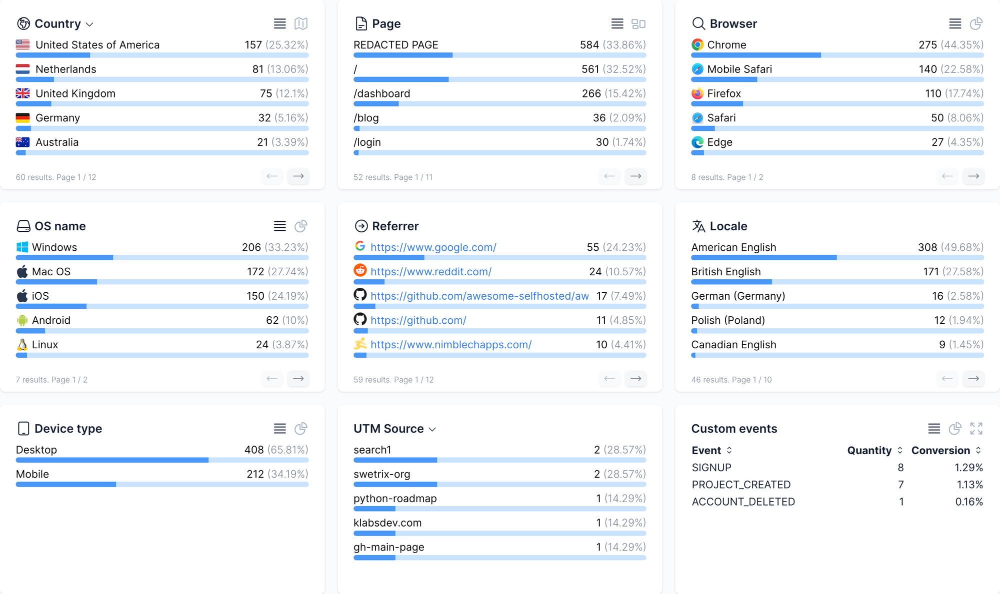
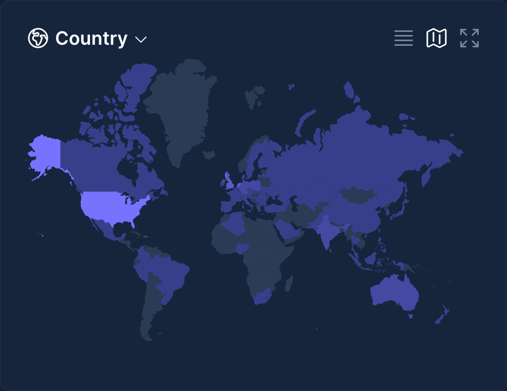
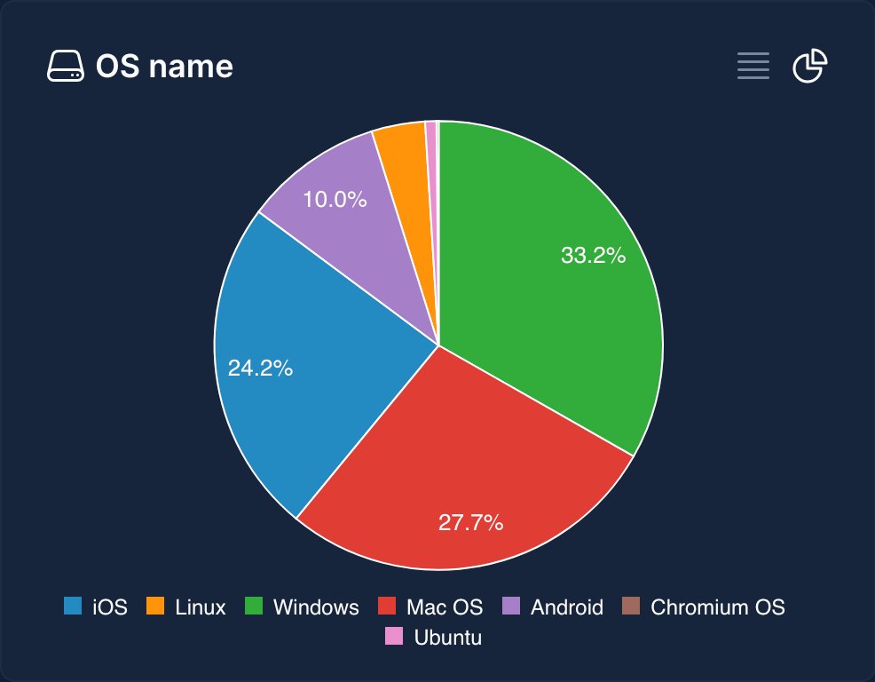
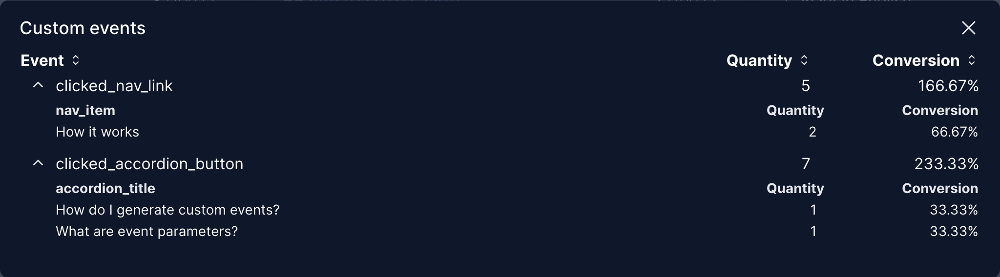
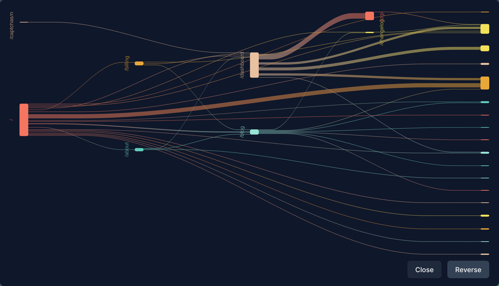

When asked about tools for web analytics, the most common response is likely Google Analytics. Whether referring to Universal Analytics or Google Analytics 4 depends on the timing of the question. This highlights that Google Analytics has been, and perhaps remains, the primary tool people think of for web analytics. While some argue that Adobe Analytics has been a market contender for a long time and offers great functionality, it's important to note its pricing. Adobe Analytics is indeed powerful, but its cost may not be feasible for everyone. Other tools like Mixpanel and Amplitude offer excellent alternatives, primarily focusing on product analytics. This is not to diminish their capability in marketing analytics; however, using them solely for this purpose might not fully leverage their potential.

One tool that stands out as a notable alternative to Google Analytics is Swetrix. Before exploring why Swetrix is a compelling choice for those seeking alternatives, it's crucial to acknowledge that both Google Analytics and Swetrix have their unique merits. This guide aims to provide reasons to consider Swetrix for your web analytics needs if you're exploring options beyond Google Analytics.

## A brief history of Swetrix

Swetrix was launched in August, 2021 as an alternative to Google Analytics that focuses on privacy while offering similar functionality to analytics tools. According to their [about us page](https://swetrix.com/about), their number one focus is transparency and simplicity. There also a couple of things that distinguish Swetrix, compared to competitors, the first things being open-source and the second being cookieless.

Swetrix, since launch, has had 683 registered users and tracked over 3.9 million events across more than 2000 websites. Despite its being a relatively new company, Swetrix offers core analytics features while being compliant with major compliance laws such as GDPR, CCPA, HIPAA and more.

## Swetrix features

### Open Source & Cookieless

One of Swetrix's main features is being open-source. This is mighty impressive as this means you can customize the tool to be what you want it to be. Another great outcome of the tool being open-source is the ability to have it on premise, that is to say to install it on your own server and managing it from there. This is relatively similar to implementing Google Analytics 4 server-side with Google Tag Manager; albeit much less costly. More importantly using open-source, software means finding bugs and making contributions to the community. That being said, an amazing side-effect of Swetrix being open-source is the ability to check what the team is working on in to know what is going to be released soon. Here's the their public [roadmap](https://github.com/orgs/Swetrix/projects/2). Swetrix is open startup, besides seeing their public roadmap for the development of the project, you can also check metrics related to their revenue, profit, costs and more. You check their metrics in their [performance page](https://swetrix.com/open). With this much information being available to the end user, we can safely state that their promise of transparency is upheld.

As for being cookieless, that is also true. For the rest of the blog post, we will show examples both from Datakyu's own website which uses Swetrix as well as the Swetrix's public dashboard.

You may ask how do I know that Swetrix is collecting data? There are two ways to go about doing that. The first one is to check your project's dashboard. Swetrix has ~1m latency when it comes to data processing which is bounds and leaps compared to Google Analytics 4, a topic we will come back to later. The second way we can check if the data has been sent is the Network tab.

Using the Network tab, not only can we confirm that data was sent to Swetrix, but also check what data was sent. As far as these features go, Swetrix is doing an amazing job at transparency and being cookieless.

### Latency in data processing

When evaluating your project's performance, it's crucial to consider the speed at which data becomes available for analysis. Swetrix boasts an impressive approximate latency of around 1 minute in data processing. This rapid turnaround is noteworthy, especially when compared to Google Analytics 4, providing near real-time reporting capabilities that can significantly benefit decision-making processes. However, it's important to approach this comparison with a nuanced perspective.

Latency, in the context of web analytics, refers to the delay between data collection and its availability for analysis on the dashboard. A shorter latency means that website owners and marketers can quickly assess and respond to user interactions, making it invaluable for monitoring live campaigns or managing abrupt changes in website traffic.

While Swetrix's data processing speed is relatively fast, allowing for quick insights into website performance, it's also essential to recognize the scope of its reporting capabilities. Compared to Google Analytics, Swetrix may not offer the same level of comprehensive reporting or boast an extensive user base. This isn't to diminish Swetrix's value but rather to highlight that it excels in providing core reporting functionalities with the added benefit of speed, making it a compelling choice for those who prioritize these aspects.

Choosing the right web analytics tool often involves considering various trade-offs. Swetrix stands out for its privacy-centric approach, simplicity, and the quick availability of data. For businesses and webmasters who value these qualities and primarily require core analytics insights without the need for highly granular data, Swetrix presents an attractive alternative to Google Analytics 4.

Therefore, we encourage potential users to carefully assess their specific needs, including their analytics requirements, privacy concerns, and the importance of accessing data swiftly. This thoughtful approach will help in making an informed decision that best aligns with your web analytics goals.

### Core Analytics

One thing that Swetrix does best, it's core analytics. That is to say if you are trying to look at your traffic, have an understanding of your visitors flow based on snapshots or look at funnels, Swetrix got you covered. First and foremost, their visualization is really good, and clear. It even allows you to check multiple metrics at the same time. Moreover, their date range picker offers multiple choices such as:

- Last 7 days
- Last 4 weeks
- Last 3 months

And more. Their date range picker also allows for custom date ranges and comparison, as well. But perhaps their greatest feature for timeline visualization is the ability to predict upcoming traffic.

Additionally, you can switch between a line chart and a bar chart for clearer visualization. Moreover, their traffic reporting tab contains allows you to see your live visitors which give you an understanding of how many users are currently on your site. Sounds familiar? Think Real Time... Another great feature of Swetrix is the overview metrics presented first thing when the dashboard loads as Figure 3 shows. Important metrics are showcased directly to the user whether in the traffic or performance reports. When checking the performance report, though, the metrics are a bit different, but they are still very important.

The metrics shown are the following:

- Frontend: a sum of such metrics as browser render time and DOM Content Load time
- Backend: Time to first byte
- Network: a sum of such metrics as DNS Resolution time, TLS Setup time, Connection time and Response time

If you are a marketer that cares about page load speeds, Swetrix offers you said information without the need to implement custom JavaScript just like Google Analytics 4.

While everything we have introduced is very impressive, the most impressive feature is yet to come. Swetrix's session reporting is nothing but short of impressive. In this report, you have an overview over your website's sessions. Upon clicking on a session, you will find a breakdown of all the pages and events that occurred in said session. Other details are also accessible:

- Country
  - Region
  - City
- OS Name
- Device type
- Browser
- Locale
- Referrer
- Campaigns
  - UTM source
  - UTM medium
  - UTM campaign

Lastly, the funnel reporting of Swetrix is a feature truly deserve to be checked. In essence, the funnel report allows you to build as many funnels as you need and the funnel configuration can be be based either on custom events or page views which gives you further flexibility for your reporting. The report itself presents 3 pieces of data:

- Visitors
- Dropoffs
- Never entered the funnel

## Traffic & Session Reporting

### Traffic Reporting

Swetrix's traffic reporting, while not as comprehensive as Google Analytics 4, still offers quite the view about acquisition data.

As Figure 8 showcases, the traffic reporting capabilities of Swetrix are basic but do offer everything a marketer needs to understand their acquisition. However, through basic, the traffic reports hold some good surprises. For instance, country data can be visualized as follows:

There is more. You can visualize data as pie chart as well:

Custom events can also be visualized and broken down based on event parameters if need be:

While this information is helpful, there are much to improve for this report. But, that's a topic for another time. Last but not least, the user flow report. This is perhaps one of the most important visualizations on Swetrix:

This visualization allows you to understand how users are navigating your website from one page to another. This report is equivalent to Google Analytics 4's Path Exploration report. You can also user the Reverse functionality to start your analysis from an endpoint instead.

## Filtering reports

Filtering reports in Swetrix is quite easy and a further demonstration of how rich in features this tool is. Filtering reports is based on the dimensions you are able to see in the report you are in. For instance, you can filter performance reports based on:

- Country
- Page
- Browser
- Device type

To filter the report, hover over the value you are interested in and click on the funnel icon. This will filter all the data you are seeing to that specific value. For instance, you can check the performance metrics for Chrome users or everyone else but Chrome users (another filtering feature).

## Configuration features

So far, we have covered the reporting features that Swetrix offers, but it offers more than that. In truth Swetrix's configuration features are advanced and offers some great flexibility; flexibility that even Google Analytics 4 does not offer.

### Shareable Dashboards & Password Protecting

An easy win over Google Analytics 4 is shearable dashboards. In fact, you can share you Swetrix dashboard with other or even make it public for others to see (the live demo on the site is the dashboard of Swetrix's own site). You can event protect your dashboard with a password if you need a selective few to see it. This is years ahead compared to sharing exploration reports in Google Analytics 4.

### Allowed origins

This setting allows you to define a list of origins, or domains, that can use your Swetrix's project ID and the script to send data to your project. What's impressive in this case is that you can define this setting on a subdomain level. For example: cornell.edu, app.example.com, \*.gov.ua. In case you were wondering, no this does not mean that cross-domain tracking is possible. This remains to be tested. This feature is more of a security feature that guarantees your project does not collect data from unauthorized domains.

### IP Blacklisting

This feature is most welcomed as it allows you to make sure that traffic from specific source is not counted in your project. As you might have guessed, this feature allows you to exclude internal traffic based on your IP. But, this is not the only interesting thing about this feature. In truth, you can use this blacklisting capability to exclude traffic coming from crawlers such as oncrawl to avoid skewing your traffic data.

## Installation & API Features

When it comes to implementation, Swetrix offers an array of choices. Swetrix can be deployed using a script, added through npm, implemented server-side or even self-hosted. The choice is yours when it comes to how to add Swetrix to your project; a choice that speaks to the power of the tool. Swetrix offers, mainly, tracking of page views, and custom events which can be done quite easily. Their events API can also be used to send events to their servers, for instance when tracking a mobile/native application. The also have a Statistics API which can be used to retrieve your project's data programmatically. This can be very useful if you want to integrate this data into your own Business Intelligence projects, or further blend it with sales data for a 360 analysis. You can even self-host Swetrix using Docker and start using the data to your own servers. This ability to self-host this analytics stool combined with the fact that it is open-source can turn into a very powerful custom tool fine-tuned to serve your specific analytics needs.

## Is Swetrix a Google Analytics 4 replacement?

The answer is yes, if you are a small/medium sized that need a tool with solid core analytics functionality; e-commerce may be an exception here. However, for a more mature business with complex analytics needs Swetrix can replace Google Analytics, but it would require some work. In truth, Swetrix has huge potential as an analytics tool and what it lacks in the UI, it makes up for in configuration, marketplace integration or even extensions. Perhaps one day it will be a full replacement to Google Analytics 4, but for now it is a great contender to Google Analytics 4.
